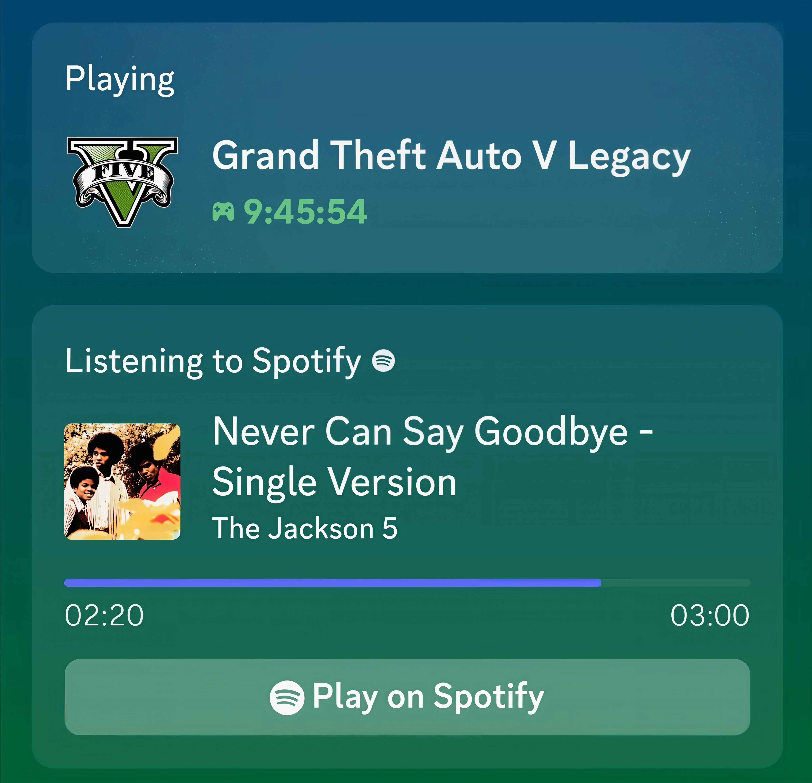

# 🎧 Discord Dual RPC (Spotify + GTA V)

Shows a fake "Listening to Spotify" status and a "Playing GTA V" status on your Discord profile at the same time.

---

## ✨ Features
- 🎵 Fake Spotify presence with album art and progress bar
- 🎮 GTA V presence running at the same time
- 🖼️ Auto-fetches album covers from Spotify
- 🔄 Loops through all songs forever
- ☁️ Includes an Express server (keeps your bot alive on free hosts)
- 🚀 Works on Render / Railway / Replit for free

---

## 📌 What You Need Before Starting

1. A Discord account
2. A GitHub account (free — create one at github.com if you don't have it)
3. Basic ability to copy and paste

That's it. No coding knowledge needed.

---

## 🚀 Step 1 — Download the Files

Download all the project files to your computer.

You will have these files:
- index.js
- package.json
- config.js
- README.md

---

## 🚀 Step 2 — Upload to GitHub

1. Go to github.com and log in (or create a free account).
2. Click the "+" button at the top right → "New repository".
3. Give it any name (for example: `dual-rpc`).
4. Set it to Public or Private — your choice.
5. Click "Create repository".
6. On the next page, click "uploading an existing file".
7. Drag all the files into the box.
8. Click "Commit changes".

Done. Your files are now on GitHub.

---

## 🚀 Step 3 — Add Your Discord Token

1. On GitHub, open `config.js`.
2. Click the pencil icon (edit).
3. Replace the text inside with your Discord token:

   module.exports = {
       TOKEN: "PASTE_YOUR_DISCORD_TOKEN_HERE"
   };

4. Scroll down and click "Commit changes".

⚠️ If the repository is Public, never paste your real token into `config.js`. Instead, set it as an Environment Variable on your host (Render / Railway).

⚠️ If the repository is Private, you can paste your real token directly — but still never share it with anyone.

---

## 🚀 Step 4 — Host It for Free

You can run this 24/7 for free using any of these websites:

- Render (render.com) — easiest
- Railway (railway.app) — also easy
- Replit (replit.com) — good for testing

General steps for all of them:
1. Sign up for free.
2. Click "New Project" or "New Web Service".
3. Connect your GitHub account.
4. Select the repository you created.
5. Deploy.

The site will run your bot for you. You don't need to keep your computer on.

---

## 🛠️ Customize

- Change the game: edit `GTA_APP_ID` in `index.js`
- Add songs: add to the `playlist` array in `index.js`
- Skip songs faster: lower `durationMs` for each song

---

## ⚠️ Note

Only the first 14 songs have working Spotify links. The rest will show blank album art. To fix, replace their `"link"` with a real Spotify link (open Spotify, search the song, tap "...", Share, Copy Song Link).

---

## ⚡ Disclaimer

This uses a selfbot library, which violates Discord's Terms of Service. Use at your own risk.

---

## 📜 License

MIT
